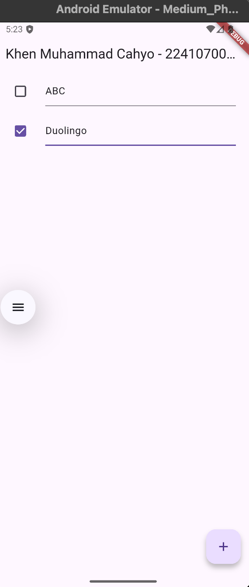
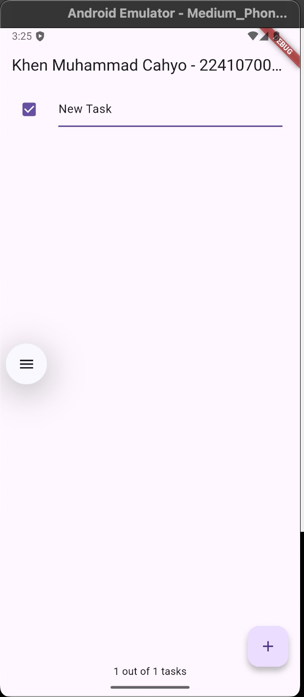
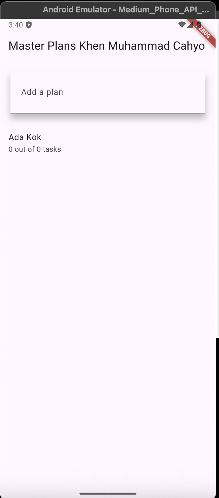

# Practicum 1 Task

## Results

## Answer Number 2
The goal is to be more concise and import the syntax directly through the `data_layer.dart` file instead of directly into the model file.

## Answer Number 3
The `plan` variable is required for the `_PlanScreenState` class to have a single `Plan` object that stores data for all tasks or plans to be displayed on the screen. By having a single `plan` instance, widgets can access and manipulate that data throughout the application. This object is created as a constant (`const Plan()`) because during initial initialization its value remains fixed (no data changes), making it efficient in memory usage and helping to ensure that the initial `plan` value does not accidentally change before user interaction.

## Answer Number 5
The `initState()` method in step 11 is used to perform initial initialization before the widget is displayed, such as creating a `ScrollController` and adding a listener so that when the user scrolls, input focus (e.g., the keyboard) is automatically closed. Meanwhile, `dispose()` in step 13 functions to clean up or release unused resources, in this case deleting the `ScrollController` to prevent memory leaks when the widget is removed from the tree.

# Practicum 2 Task

## Results

## Answer Number 2
`InheritedWidget` in step 1 refers to a Flutter base class used to share data from a parent widget across subtrees without having to manually pass values ​​through the constructor. In the code, `PlanProvider` is an instance of `InheritedNotifier`, which is a specialized form of `InheritedWidget` that can monitor data changes via `ValueNotifier`. The reason for using `InheritedNotifier` is that in addition to being able to pass data to child widgets like `InheritedWidget`, it also automatically notifies its child widgets to rebuild when the value inside `ValueNotifier<Plan>` changes — making it more efficient and reactive than a regular `InheritedWidget`.

## Answer Number 3
The two methods in step 3 are used to calculate and display the task completion progress in the `Plan` object. The `completedCount` method counts the number of completed tasks (`task.complete == true`), while the `completenessMessage` creates a concise message that shows the ratio between the number of completed tasks and the total number of remaining tasks. This allows the application to dynamically display the user's progress without recalculating each UI section, resulting in more efficient and readable code.

# Practicum 3 Task

## Results
