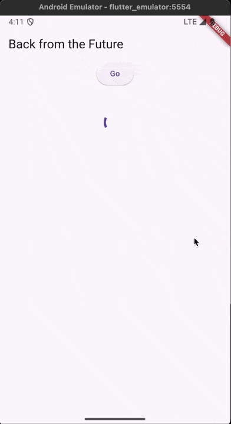
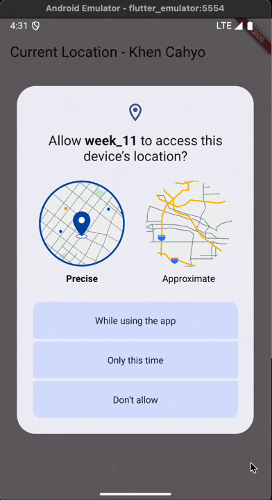
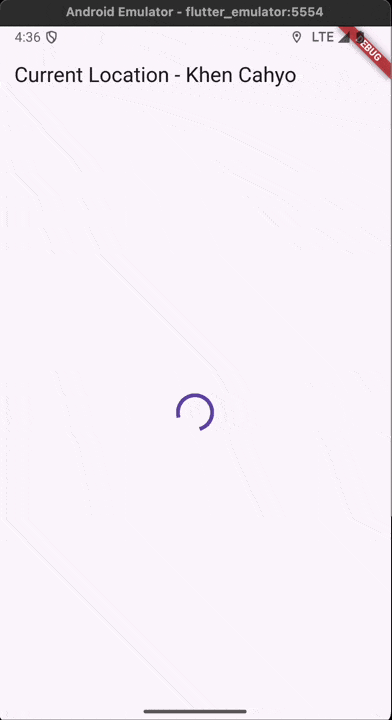
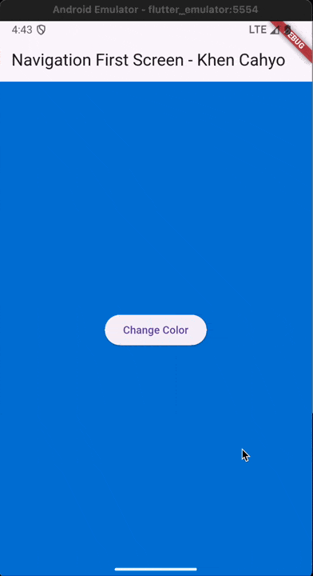
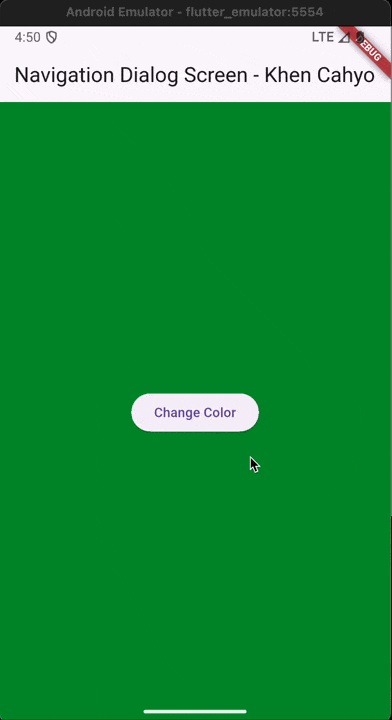

## Practicum 1 - Question 3
### Explain the meaning of step 5 codes `substring` and `catchError`
In Flutter, `substring` is a method from the Dart `String` class that extracts part of a string based on the start and end index, allowing you to clean, trim, or format text before using it. Meanwhile, `catchError` is used with Futures to handle errors that occur during asynchronous operations; it lets you intercept failures, provide fallback logic, and prevent the app from crashing when something goes wrong.

## Practicum 2 - Question 4
### Explain the meaning of step 1 and 2 codes
This code defines three asynchronous functions that each wait for three seconds before returning the numbers 1, 2, and 3. The `count()` function then awaits these functions one by one, adding their results to a `total` variable. After all three async operations finish, it updates the UI by calling `setState()` and assigning the final sum to the `result` variable.

## Practicum 3 - Question 5
### Explain the meaning of step 2 codes
This code uses a `Completer` to manually control when a `Future` is completed. The `getNumber()` function creates a new `Completer`, triggers the `calculate()` function, and returns the `Future` associated with the completer. Inside `calculate()`, the code waits five seconds and then calls `completer.complete(42)`, which resolves the returned `Future` with the value `42` once the delay is finished.

## Practicum 3 - Question 6
### Explain the differences between codes in step 2 and 5,6
The difference is that this version adds error handling using a `try–catch` block. In the previous code, the `Future` is always completed successfully with `completer.complete(42)` after the delay. In this new version, if something goes wrong inside the `try` block, the `catch` block runs and calls `completer.completeError({})`, which completes the `Future` with an error instead of a value. This makes the code more robust because it can signal success or failure to whoever is awaiting the `Future`.

## Practicum 4 - Question 8
### Explain the differences between codes in step 1 and 4
The first approach uses `Future.wait`, which runs all the futures in parallel and returns a single future that completes when all of them finish, giving you a list of results. The second approach uses `FutureGroup`, which lets you dynamically add futures one by one before closing the group, making it more flexible when the number of tasks isn’t fixed at initialization. While both ultimately return a list of values once all futures complete, `Future.wait` is simpler and static, whereas `FutureGroup` is more dynamic and suitable for situations where futures are added conditionally or at different times.

## Practicum 5 - Question 9
### Explain the differences between codes in step 1 and 4
The `returnError()` function always waits three seconds and then throws an exception, meaning it will never complete successfully. Meanwhile, `handleError()` calls this function inside a `try–catch` block so it can safely catch the thrown error and update the UI by setting `result` to the error message. The `finally` block runs afterward regardless of success or failure, printing “Complete,” which ensures cleanup or final actions still happen even when an error occurs.

## Practicum 6 - Question 12
### Got Location in the browser
In a browser, Flutter cannot always access the device’s actual GPS hardware, so location results are often inaccurate or unavailable. This happens because web applications are restricted for security reasons, and the browser usually provides only approximate location based on WiFi, network data, or IP address instead of real GPS signals. As a result, even if your Flutter location code is correct, running it in the browser may not return precise coordinates like it would on a mobile device.

## Practicum 7 - Question 13 & 14
### UI Comparison
The difference is that `FutureBuilder` reacts to the asynchronous process, while a normal `Text(position)` does not. With `FutureBuilder`, the UI automatically updates based on the future’s state: it shows a loading spinner while waiting, displays an error message if something fails, and shows the final position once the future completes. If you only use a plain `Text` widget with the position string, the text will not update automatically while the future is running—you would need to manually call `setState()` and manage loading/error states yourself.

## Practicum 8 - Question 15 & 16
### What happens when the buttons clicked?
When the user taps the button on the first screen, it navigates to the second screen and waits for a returned value using `Navigator.push`. On the second screen, choosing a color triggers `Navigator.pop(context, selectedColor)`, which sends that color back to the first screen. The first screen receives this value as `result`, updates its `color` variable, and calls `setState()`, causing the background color to change. This works because Flutter’s navigation system allows passing data back when popping a route, and `Future` from `Navigator.push` completes with the returned value, enabling the first screen to update once the second screen is closed.

## Practicum 9 - Question 15 & 16
### What happens when the buttons clicked?
When a button inside the dialog is clicked, the app immediately updates the `color` variable using `setState()`, which changes the background color of the main screen behind the dialog. After updating the state, `Navigator.pop(context)` is called, closing the dialog and returning the user to the main screen. Because the state was updated before the dialog closed, the background color of the main screen is already changed when the dialog disappears.

