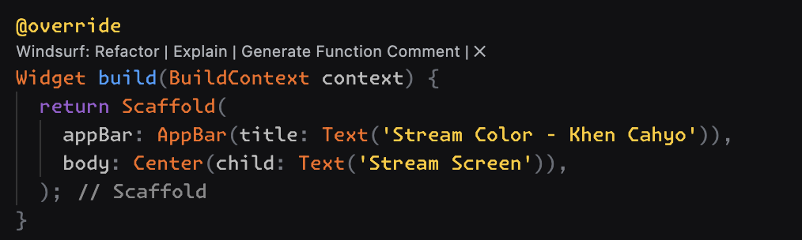
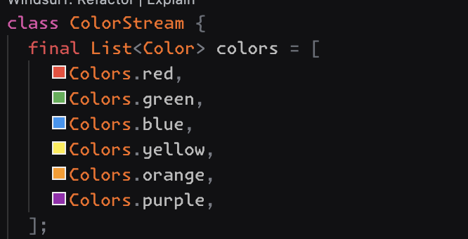
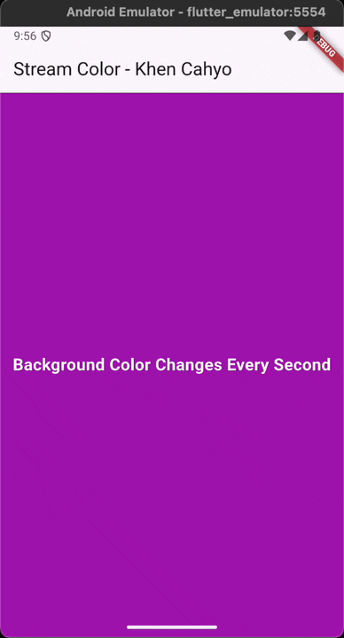
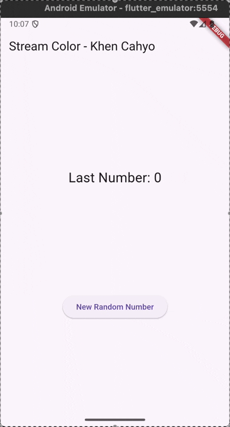
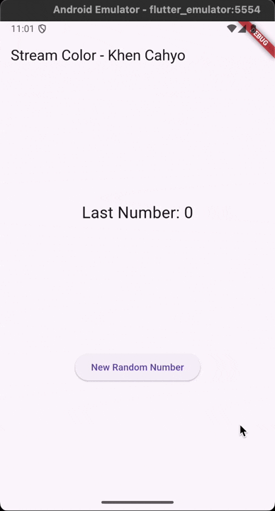
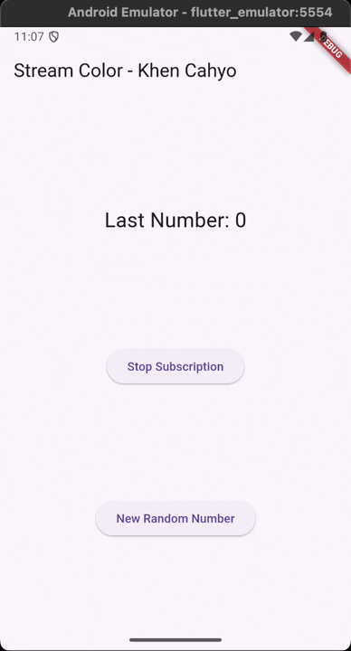
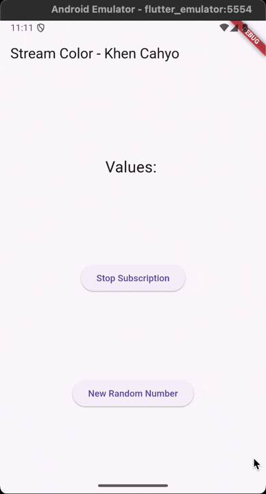
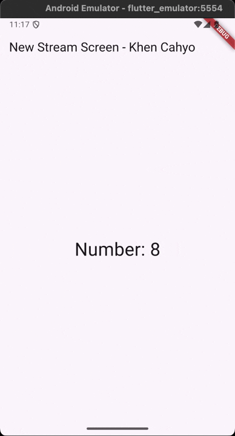
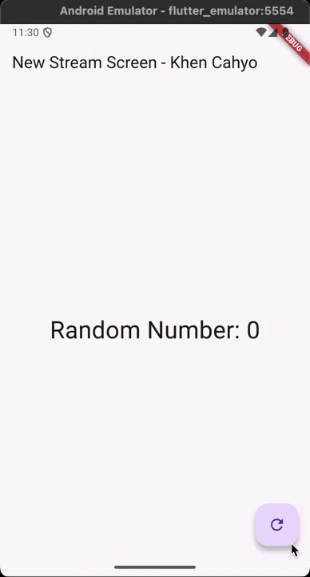

## Practicum 1 - Dart Streams
### Answer Question 1

### Answer Question 2

### Answer Question 3
In Dart, `yield` is used inside an async generator function to send a single value to the stream without ending the function. Each time `yield` runs, it emits a value and then pauses until the next event is requested. In this example, `yield*` is used to forward all values from another stream—in this case, a periodic stream that emits a new color every second—so the generator simply passes those emitted values directly to anyone listening to the `getColors()` stream.

### Answer Question 4

### Answer Question 5
The commented code uses `await for`, which waits for each stream event one at a time in a sequential, asynchronous loop; this means the function won’t continue until the stream finishes (which in this case never happens). The uncommented code uses `listen`, which sets up a stream subscription that reacts to each new event without blocking the function, allowing the app to continue running normally while still updating the color whenever a new value arrives. Essentially, `await for` consumes the stream in a blocking manner, while `listen` handles events asynchronously through callbacks.

## Practicum 2 - Stream Controllers & Sinks
### Answer Question 6
Code 8 sets up a listener in `initState()` that watches the stream from `numberStreamController`; every time a new number is emitted, `setState()` is called to update `lastNumber`, causing the UI to refresh with the latest value. Meanwhile, code 10 (`addRandomNumber`) generates a random number and sends it into the stream using `addNumberToSink`, which then triggers the listener set earlier. Together, they create a real-time update flow where pressing the button adds a new number to the stream and the UI automatically reacts to it.

### Answer Question 7
In codes 13–15, the stream is set up to handle both normal events and errors: when an event is received, the listener updates `lastNumber` with the emitted value, but when an error occurs, the `onError` handler sets `lastNumber` to `-1` to indicate failure. The `addError()` method triggers this behavior by sending an error into the stream using `sink.addError`, and `addRandomNumber()` calls this method instead of adding a normal number, causing the UI to update with the error state.

## Practicum 3 - Data Injection into Streams
### Answer Question 8
In codes 1–3, a `StreamTransformer` is created to modify the stream before it reaches the listener. The `handleData` callback takes each incoming number and sends a transformed value—multiplying it by 10—into the sink, while `handleError` catches any errors and replaces them with `-1` instead of letting the error propagate. The transformed stream is then listened to, and every resulting value updates `lastNumber` in the UI, giving you a clean, pre-processed stream output.

## Practicum 4 - Subscribe to Stream Events
### Answer Question 9
In codes 2, 6, and 8, the stream subscription is set up to handle normal events, errors, and completion: code 2 listens to the stream and updates `lastNumber` whenever a new value arrives; code 6 adds an `onError` handler that sets `lastNumber` to `-1` if the stream emits an error; and code 8 registers an `onDone` callback that prints a message when the stream is closed. Together, these ensure the app properly reacts to all stream states—data, error, and completion—while keeping the UI updated accordingly.

## Practicum 5 - Multiple Stream Subscriptions
### Answer Question 10
The error occurs because the same stream is being listened to twice, while a default Dart stream is a **single-subscription stream**, meaning it can only have one active listener at a time. When the first `listen()` call attaches a subscriber, the stream is locked for that listener; the second `listen()` call tries to attach another subscriber to the same stream, causing Dart to throw `StateError (Bad state: Stream has already been listened to.)`. To have multiple listeners, the stream must be converted into a broadcast stream.

### Answer Question 11
It works again because `asBroadcastStream()` converts the original **single-subscription stream** into a **broadcast stream**, which *allows multiple listeners at the same time*. A normal stream can only have one active listener, so calling `listen()` twice causes a `Bad state` error. But after converting it to a broadcast stream, the stream becomes shareable, meaning it can send events to several subscribers without restriction. Therefore, both `subscription` and `subscription2` can listen to the same stream without causing an error.

## Practicum 6 - StreamBuilder
### Answer Question 12
In codes 3 and 7, the `getNewNumberStream()` method creates an endless stream that emits a new random number every second using `yield*` and `Stream.periodic`, making it continuously produce data for the UI. Meanwhile, the `StreamBuilder` listens to this stream and rebuilds its widget every time a new number arrives; if there is data, it displays the latest number on screen, and if an error occurs, it logs the error. Together, they create a real-time UI that updates once per second with fresh random values.

## Practicum 7 - BLoC Pattern
### Answer Question 13
The BLoC concept in this code appears in how all business logic is separated from the UI using `StreamController`, `Sink`, and `Stream` inside the `RandomBloc` class. The UI never generates or processes data directly; instead, it sends an event by calling `generateRandom.add(null)` and listens for results through the `randomNumber` stream. All logic for producing a random number and managing the data flow happens inside the BLoC, not in the widget. This follows the core BLoC pattern: the UI sends **input events**, the BLoC handles the **business logic**, and the UI rebuilds based on the **output stream**, keeping logic and presentation clearly separated.

