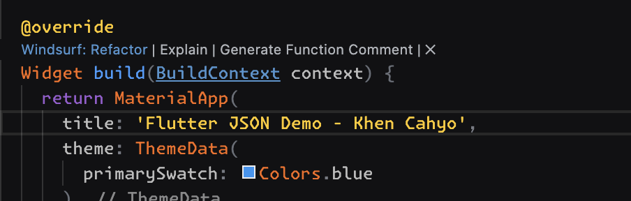
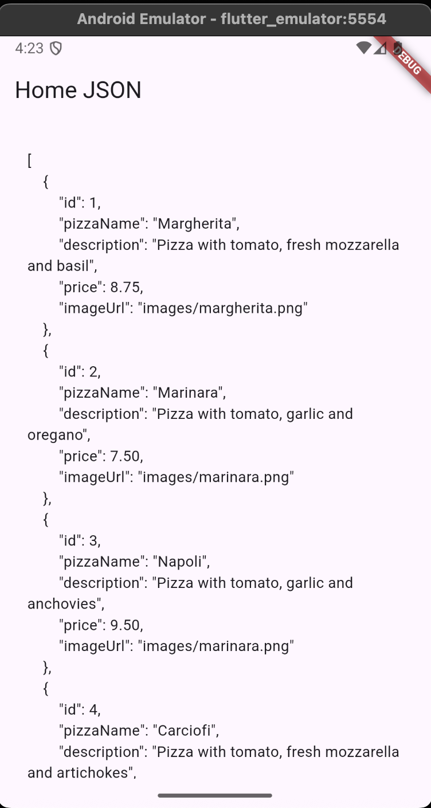
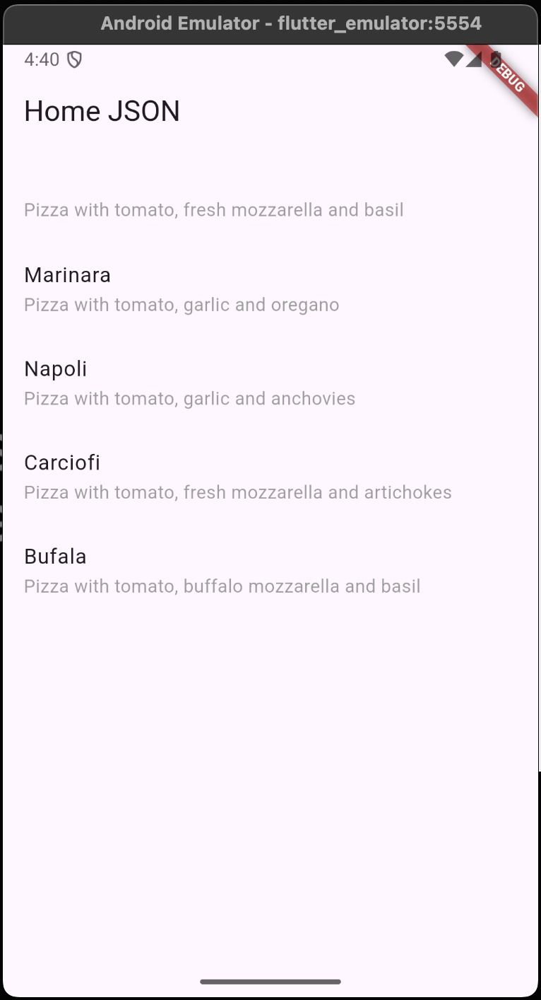
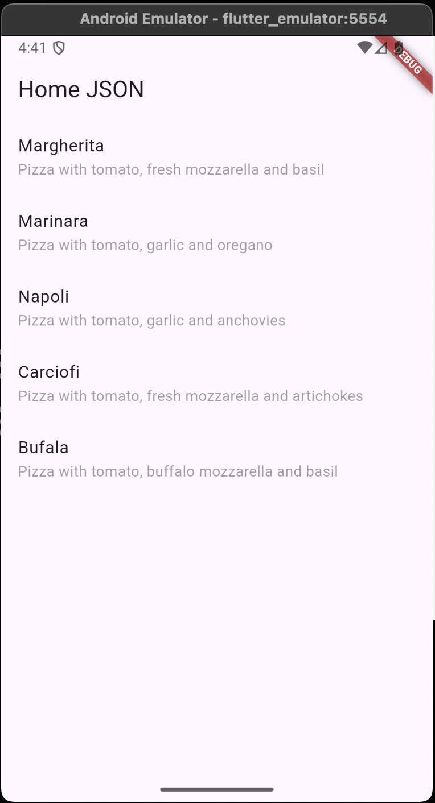
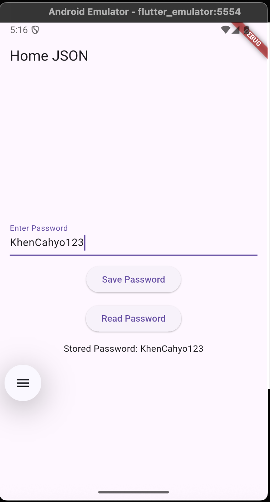

## Practicum 1
### Question 1

### Question 2

### Question 3

## Practicum 2
### Question 4

## Practicum 3
### Question 5
Using constants for JSON keys makes the code significantly safer and more maintainable because it prevents hard-coded string duplication across the model, reducing the chance of typos and silent bugs when parsing or serializing data. If a key ever changes—either in the API response or in the data structure—you only need to update it in one place instead of hunting through the entire codebase. This improves readability, ensures consistency, and helps avoid runtime errors caused by mistyped strings. It also aligns with clean-code principles by centralizing configuration and making the intent of each key clearer to future developers.

## Practicum 4
### Question 6

## Practicum 5
### Question 7

## Practicum 5
### Question 7

## Practicum 6
### Question 8

## Practicum 7
### Question 9
