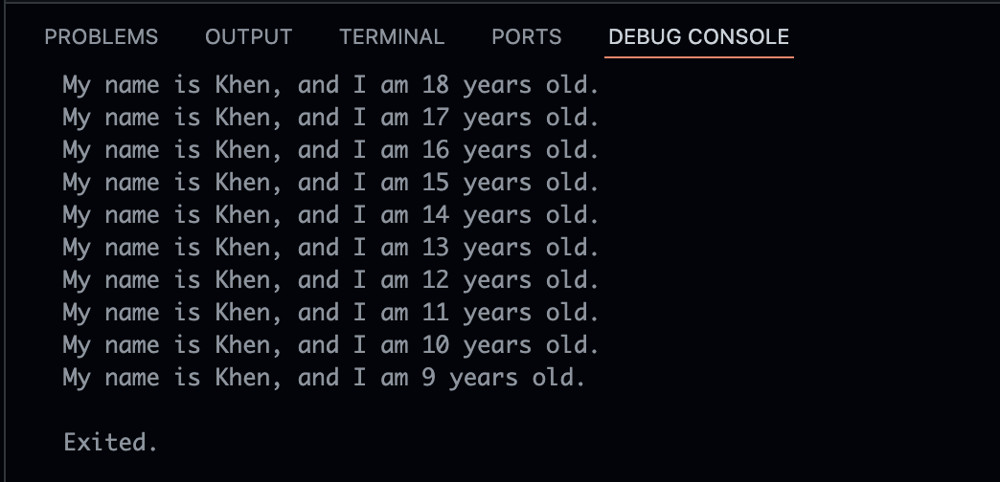
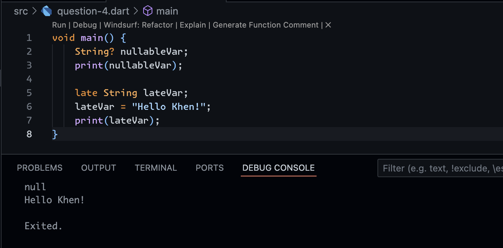

## Answer Number 1



## Answer Number 2

Understanding the Dart programming language before using the Flutter framework is essential because Flutter is built entirely on Dart, so all logic, data structures, state management, and interactions between components are written in that language. By mastering Dart, a developer can more easily understand the basic concepts of Flutter, such as widgets, async/await for asynchronous processing, null safety, and the OOP paradigm used. Without a good understanding of Dart, using Flutter will be confusing because developers will only memorize the syntax without truly understanding the workflow behind the code, which can hinder productivity, debugging, and the development of complex applications.

## Answer Number 3

**1. The Importance of Dart for Flutter**

- Dart is the core language of Flutter; all application code, plugins, and dependency management are written in Dart.

- Understanding Dart means understanding the logical foundation used by Flutter, so developers don't just memorize syntax, but also understand how the application works.

- With a mastery of Dart, debugging, performance optimization, and utilization of Flutter features will be easier.

**2. Evolution and Characteristics of Dart**

- Launched in 2011, initially to replace JavaScript in web development.

- **2013**: first stable version.

- **2018 (Dart 2.0)**: Focus on mobile development through Flutter.

- **Key advantages**:

- **Productive tooling**: IDE support, plugins, extensive package ecosystem.

- **Garbage collection**: Automatic memory management.

  - **Type safety + inference**: data type safety even with optional annotations.

  - **Portability**: can be compiled to JavaScript or native ARM/x86.

  - Suitable for high-performance cross-platform applications.

**3. How Dart Execution Works**

- **Two compilation modes**:

- **JIT (Just-In-Time)**: used during development. Supports debugging, fast for experimentation, enables hot reload.

  - **AOT (Ahead-Of-Time)**: used for production. High performance, faster startup, but does not support debugging/hot reload.

- **Execution via**:

  - Dart VM (command line / dev).

  - Compilation to JavaScript (for web).

- This feature makes Dart flexible for cross-platform development.

**4. Programming Concepts in Dart**

- **Dart is Object-Oriented Programming (OOP), supporting**:

  - Encapsulation (hiding implementation details).

  - Inheritance (class inheritance).

  - Abstraction (abstract classes/methods).

  - Polymorphism (methods with different forms on different objects).

- All data in Dart is an object (there are no pure primitives like in Java).

- Operators can be considered methods of a class, so they can be overridden.

**5. Basic Dart Syntax**

- **main() function**: the program entry point, required in every application.

- **Variables and operators**:

  - Arithmetic (+, -, *, /, ~/, %).

  - Relational (==, !=, <, >, <=, >=).

  - Logical (&&, ||, !).

  - Increment/Decrement (++, --).

  - Control flow similar to other languages: if, else, for, while, switch.

- **Function vs Method**:

  - Function → defined outside a class.

  - Method → bound to a class/object, has access to this.

## Answer Number 4



In Dart, null safety ensures that variables cannot be ```null``` unless explicitly declared with a ```?```, thus helping to prevent ```null reference``` errors at runtime, for example, ```String? name;``` means that the variable name can be ```null```, whereas ```String name = “A”;``` cannot be ```null```. Meanwhile, the ```late``` keyword is used when a non-nullable variable cannot be immediately initialized at declaration, but will be ensured to be filled before use, this is useful for dependency injection or delayed initialization. Thus, null safety ensures that variables do not arbitrarily have null values, while late allows delayed initialization without violating null safety rules.