## Practicum 1 - Answer 1

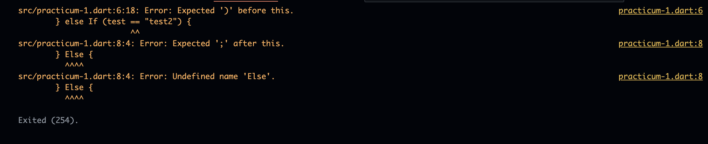

The code in step 1, when executed, will produce the results shown in the image above. This occurs due to incorrect syntax in the ```else If``` and ```Else``` statements, resulting in several error codes, such as the ```==``` symbol, which is incorrectly written elsewhere if.

## Practicum 1 - Answer 2

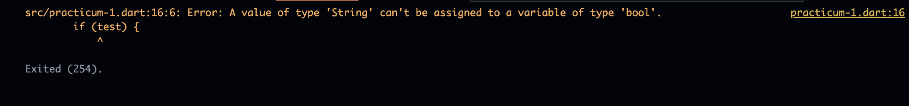

When running the code in step 3 in practical 1, an error occurs as in the image above. This occurs because the ```String``` data type in the test cannot be considered a ```bool```, because the value of ```if (test)``` will return a boolean, so we need to change the data type from test to ```bool``` and the result will be as in the image below.

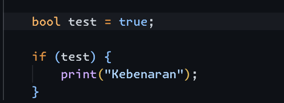

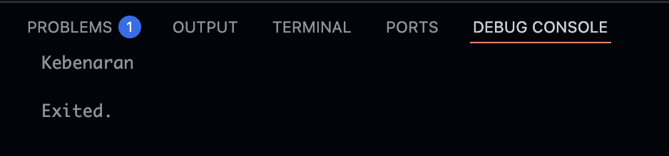

## Practicum 2 - Answer 1

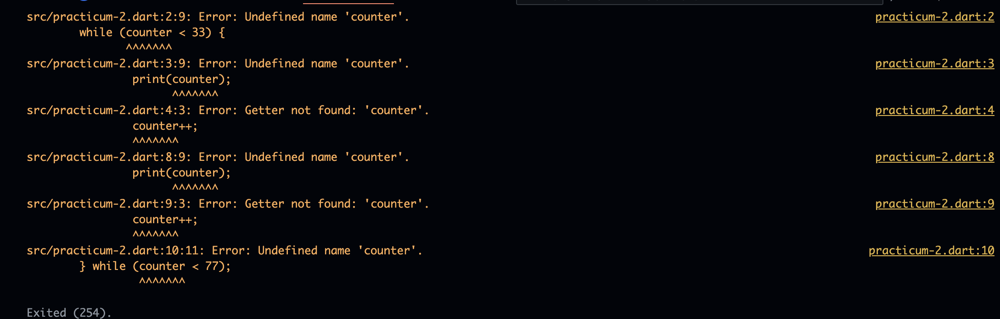

When running the practical code 2 in steps 1 and 3, all errors occur because the counter variable with the int data type itself has not been defined, so to run the code we must define the counter variable with the int data type and if it is run, the results will look like the image below.

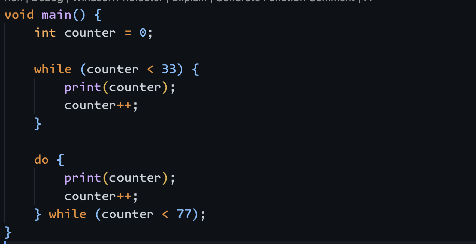

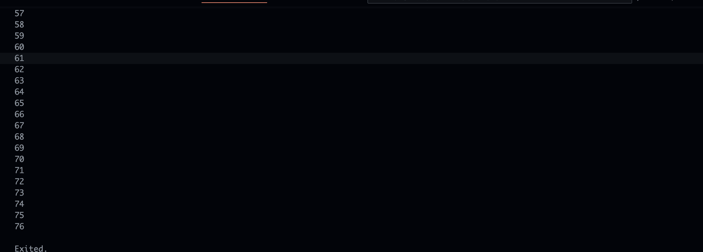

## Practicum 3 - Answer 1

When running the code in step 1, an error occurs with the ```Index``` variable. This error occurs because the ```Index``` variable hasn't been defined yet, so we must define it first.

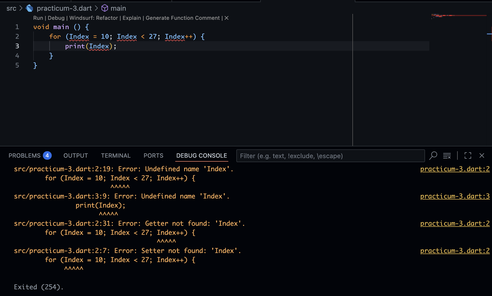

## Practicum 3 - Answer 2

After adding the code in step 3, more errors occurred. These errors were caused by incorrect ```else if``` syntax and an undefined ```Index``` variable.

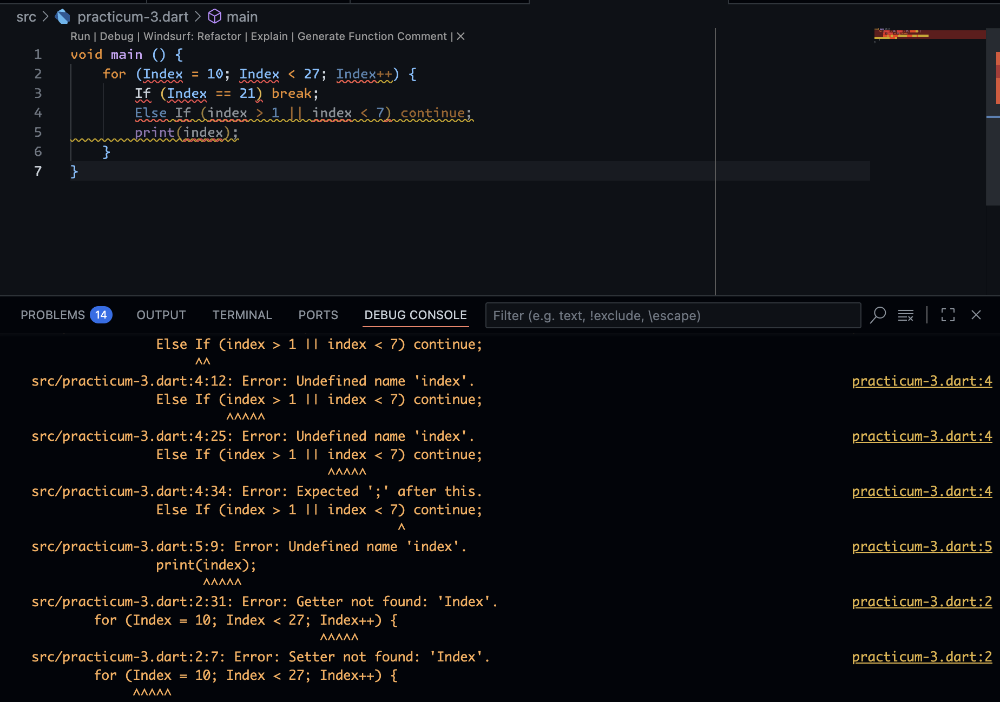

Since the code needs to be fixed, here is the fixed code:

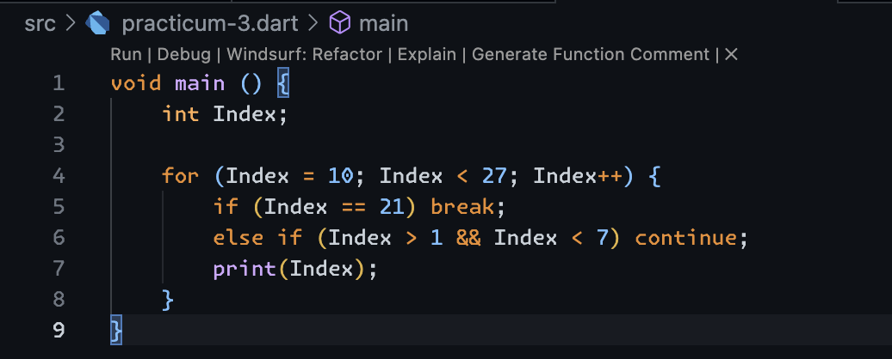

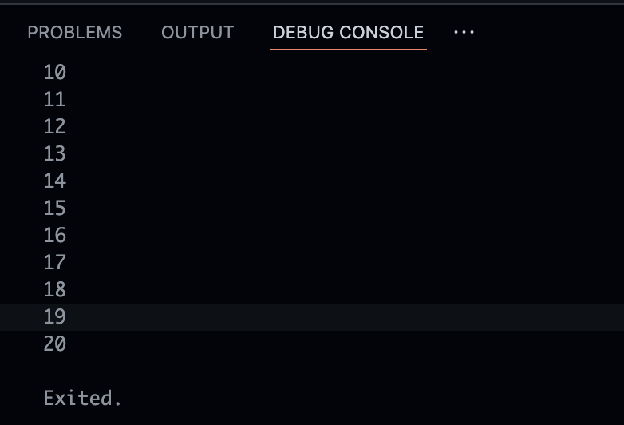

## Task Number 2 - Prime Numbers

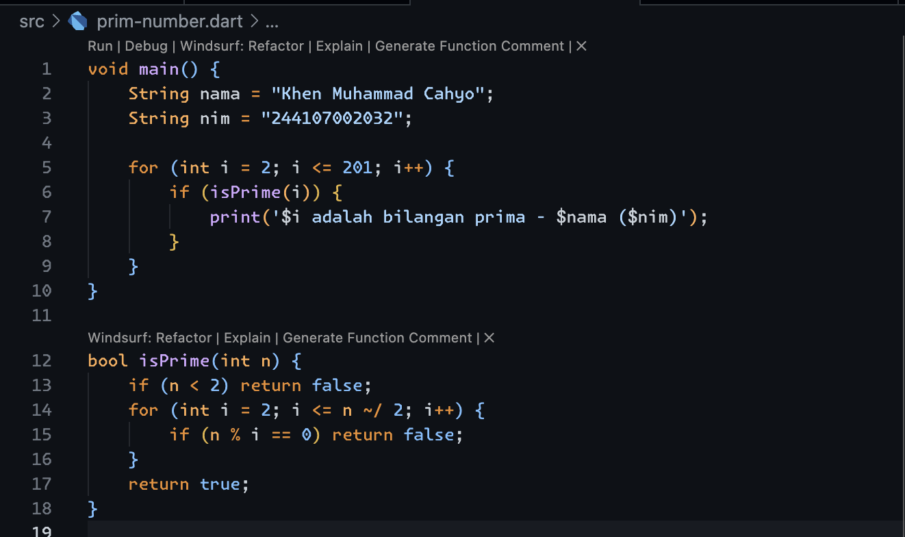

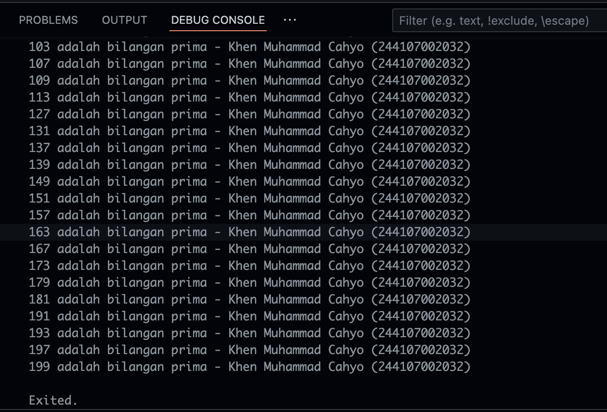