## Practicum 1 - Answer 1

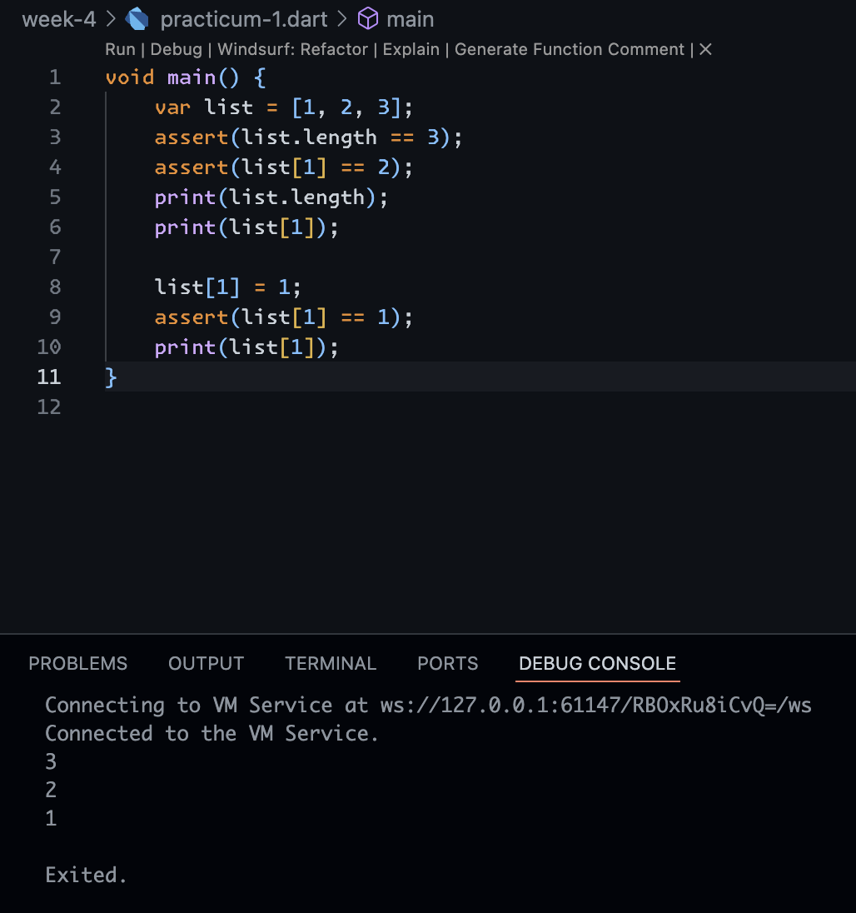

The code is demonstrates how lists (arrays) work and the use of ```asserts```. First, a list with three elements ```[1, 2, 3]``` is created, then an assert is verified that the length of the list is 3 and the element at index 1 is 2. After that, the program prints the length of the list (3) and the value at index 1 (2). Next, the element at index 1 is changed to 1, an ```assert``` is verified again that the value is 1, and the result is printed. Thus, this code demonstrates that lists in Dart are mutable (their contents can be changed), and that ```asserts``` are used to ensure certain conditions are true at runtime (usually only active in debug mode).

## Practicum 1 - Answer 2

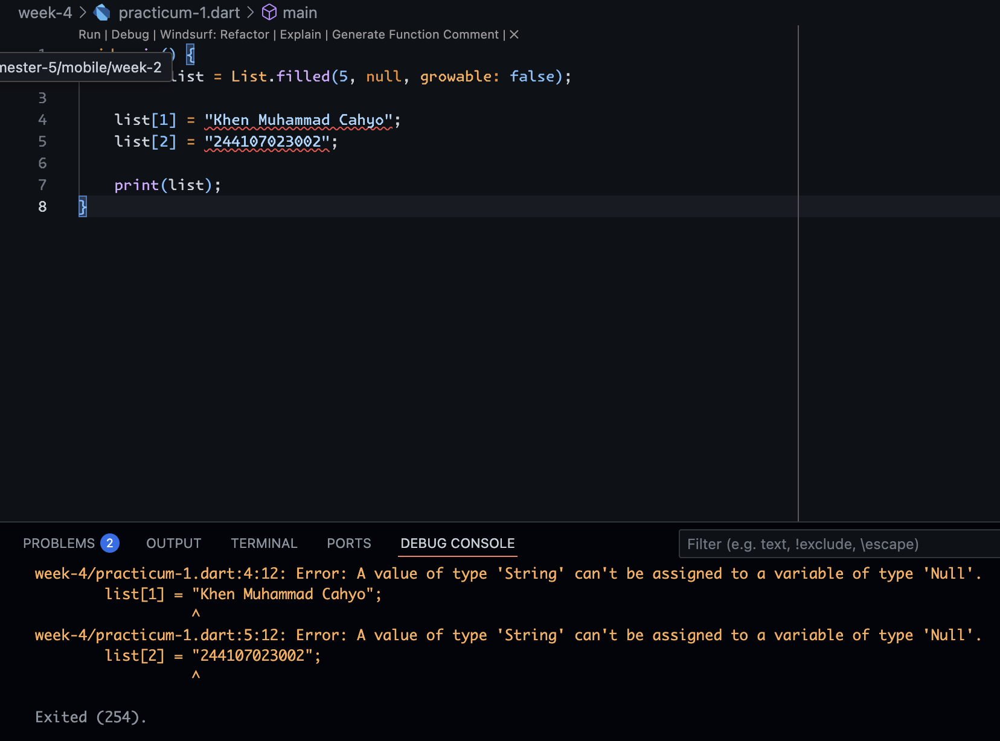

This error occurs because when creating a list with ```List.filled(5, null)```, Dart defaults to assuming the list is of type ```List<Null>```, so each element can only be ```null```. When we try to fill an element with a ```String```, Dart rejects it because ```String``` types cannot be inserted into ```List<Null>```. To fix this, we need to define a list data type that can accommodate String values ​​(e.g., ```List<String?>```) so that elements can be ```null``` or ```String```. Fixed code wiill shown as well below

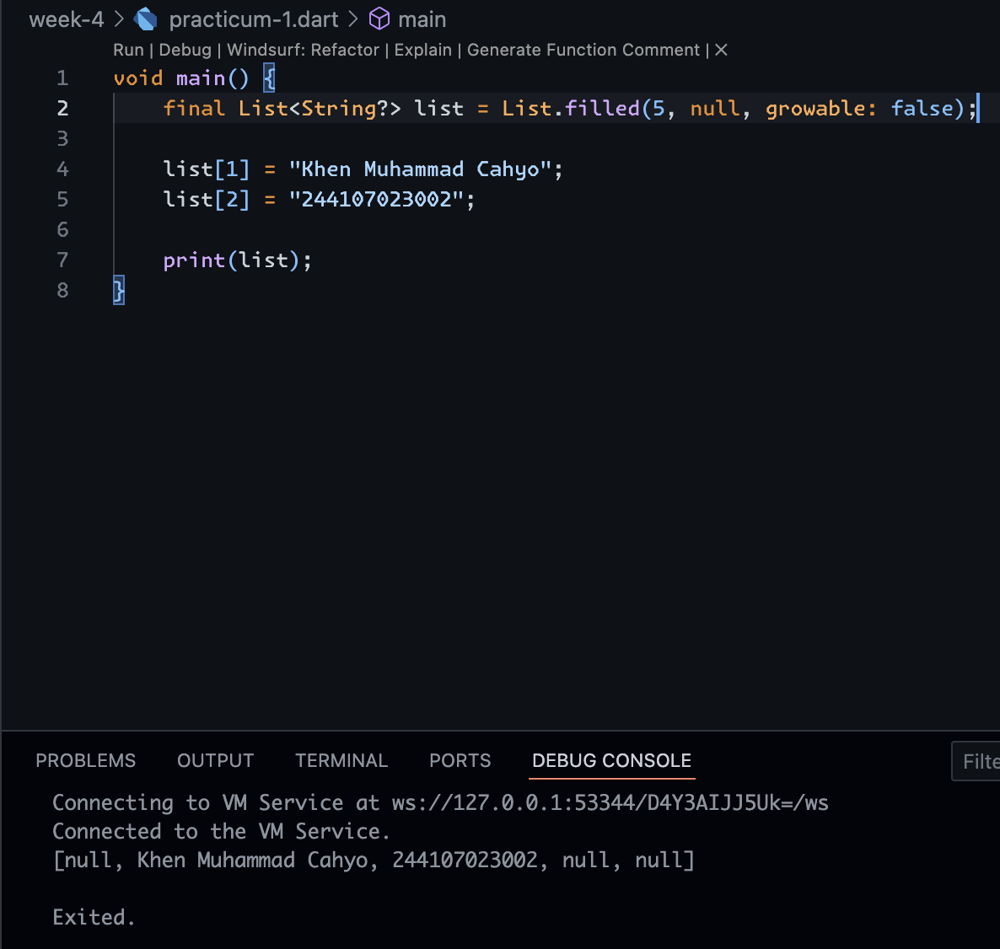

## Practicum 2 - Answer 1

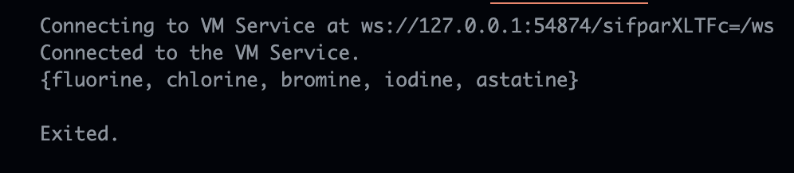

The code runs normally because in Dart, curly braces ```{}``` without a ```key:value``` pair are treated as a ```Set``` literal, not a ```Map```. So halogens is a ```Set``` containing the unique elements ```"fluorine"```, ```"chlorine"```, ```"bromine"```, ```"iodine"```, and ```"astatine"```. When print(halogens) is called, Dart displays the contents of the ```Set``` in ```{…}``` notation. No error occurs because the declaration and usage are correct.

## Practicum 2 - Answer 2

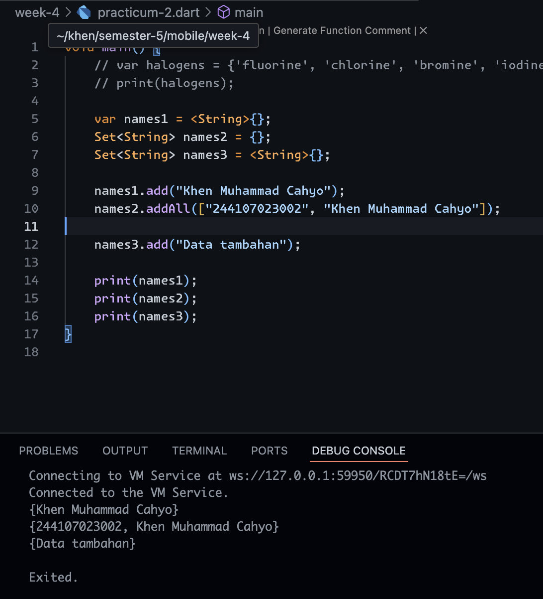

In the code, names1 is declared as a ```Set<String>``` using the literal ```<String>{}```, ```names2``` is also of type ```Set<String>``` because it is explicitly defined, while ```names3``` without a type is considered an empty ```Map<dynamic, dynamic>```, not a ```Set```, so treating it like a Set will cause an error. To fix this while still using all three variables, ```names3``` must be explicitly declared as ```Set<String> names3 = <String>{};```. After that, we can add data to the Set in two ways, for example ```names1.add("Khen Muhammad Cahyo")``` to add one element, and ```names2.addAll(["244107023002", "Nama Lain"])``` to add multiple elements at once. This way, the code can run without error, all three variables are still used as ```Set<String>```, and the printout will display the contents of the set according to the elements that have been added.

## Practicum 3 - Answer 1

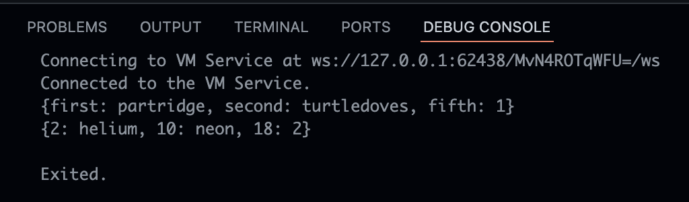

The code demonstrates the use of ```Map``` in Dart, a key-value pair data structure. The gifts variable contains a ```Map<String, Object>``` with string keys ```('first', 'second', 'fifth')``` and string or integer values. Meanwhile, ```nobleGases``` is a ```Map<int, Object>``` with number keys ```(2, 10, 18)``` and ```string``` or ```integer``` values. When ```print()``` is called, Dart displays the map contents in ```{key: value}``` format, so we can see the key and value pairs as declared.

## Practicum 3 - Answer 2

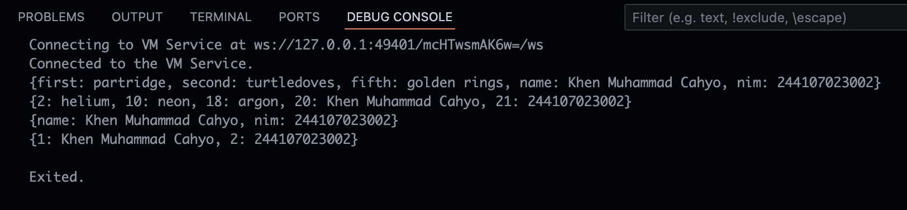

When the additional code is run, no error occurs because the Map in Dart can be created empty and then filled with key-value pairs according to the specified type. The gifts and ```nobleGases``` variables are initially of type ```Map<dynamic, dynamic>``` so they can hold various types of values, while mhs1 is of type ```Map<String, String>``` and ```mhs2``` is of type ```Map<int, String>``` which is more specific. After being filled with additional data (name and student ID), each variable successfully holds pairs according to its type, and the printout will display the contents of the map in ```{key: value}``` format.

## Practicum 4 - Answer 1

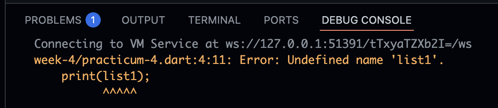

That code will shown an error, because ```list1``` variable is not defined. So, we must create a ```list1``` variable and the results will be like this.

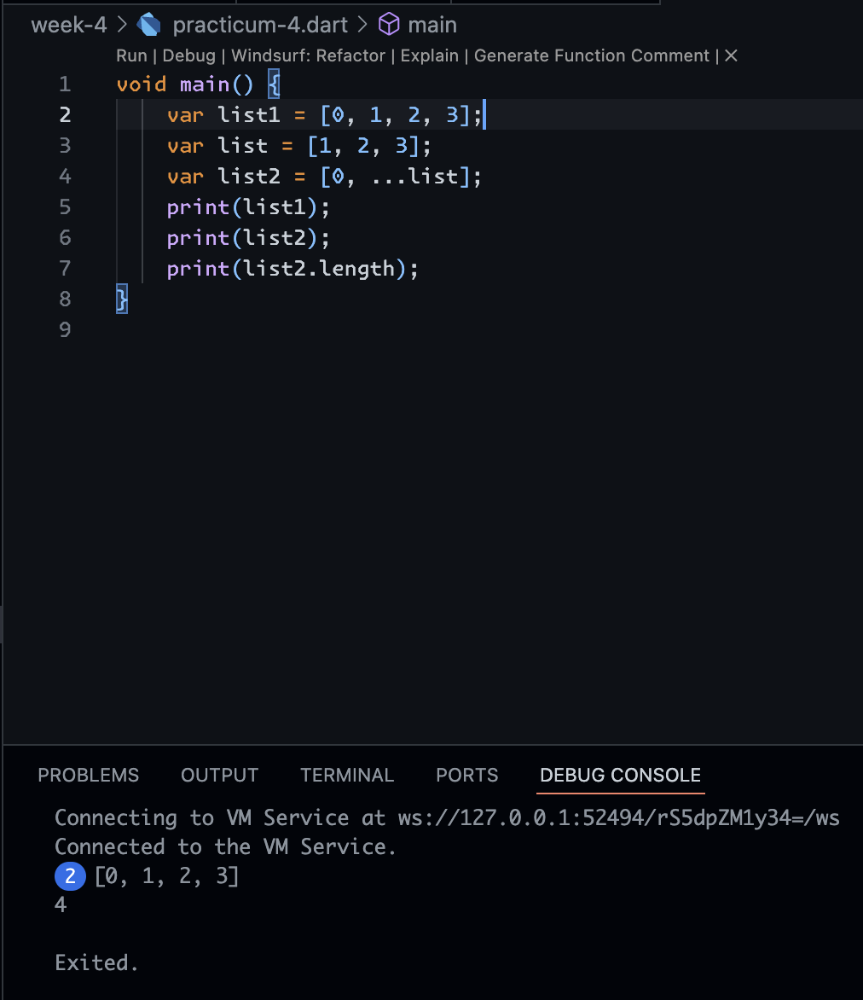

## Practicum 4 - Answer 2

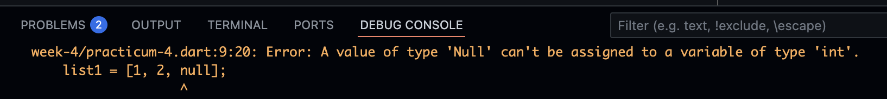

Dart defaults to assuming ```list1``` is of type ```List<int>```, so all its elements must be ints. When you pass in null, the ```Null``` type cannot be passed into ```List<int>``` (because int is non-nullable in Dart).

And the new code with NIM using spread operators will be like this

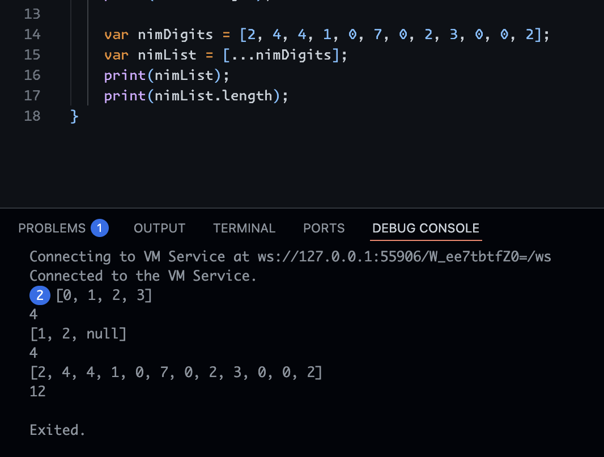

## Practicum 4 - Answer 3

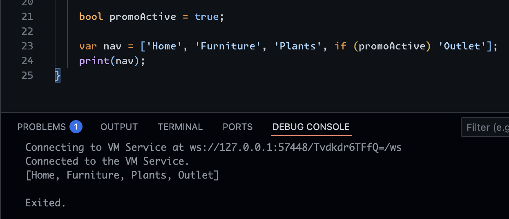

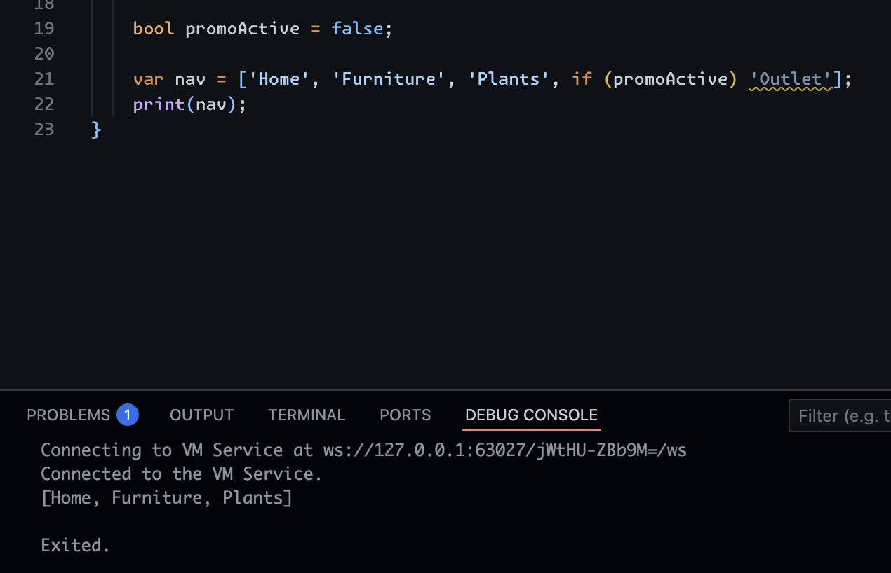

## Practicum 4 - Answer 4

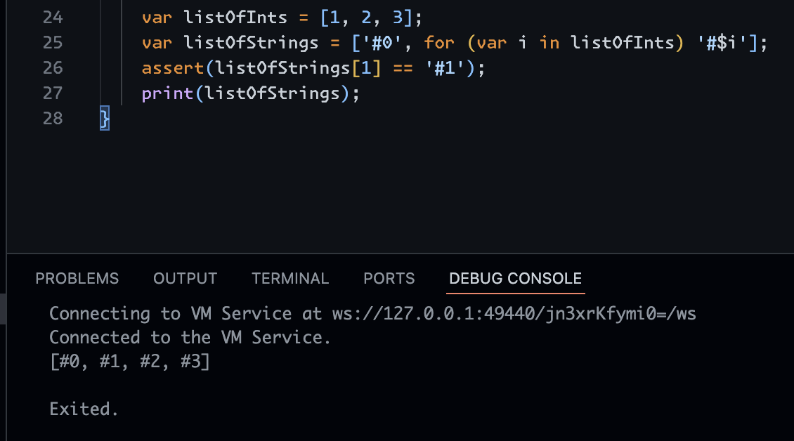

In the code above, ```listOfInts``` is a list containing ```[1, 2, 3]```. Then, ```listOfStrings``` is created using the Collection For loop, a feature in Dart that allows us to add elements to a collection (such as a List, Set, or Map) using a loop directly within a literal. The line ```['#0', for (var i in listOfInts) '#$i']``` will create a new list with the first element '#0', then add the iteration result of listOfInts, so the final result is ```['#0', '#1', '#2', '#3']```. The ```assert(listOfStrings[1] == '#1')``` ensures that the second element is indeed '#1', and print displays the list.

The benefit of the Collection For loop is that it makes code more concise, clear, and readable when you want to create a new collection from iterations or data transformations, without having to write a separate loop outside the collection declaration.

## Practicum 5 - Answer 1

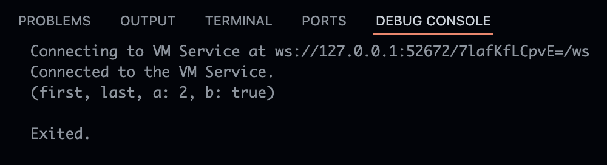

This code creates a record in Dart, a new data type similar to a tuple that can store multiple values ​​with both positional and named fields. In the example ```('first', a: 2, b: true, 'last')```, the record contains two positional values ​​('first' and 'last') and two named values ​​```(a: 2 and b: true)```. When printed with ```print(record)```, Dart displays the entire record in the format ```(first, a: 2, b: true, last)```. Records are useful for grouping multiple data without having to create a special class.

## Practicum 5 - Answer 2

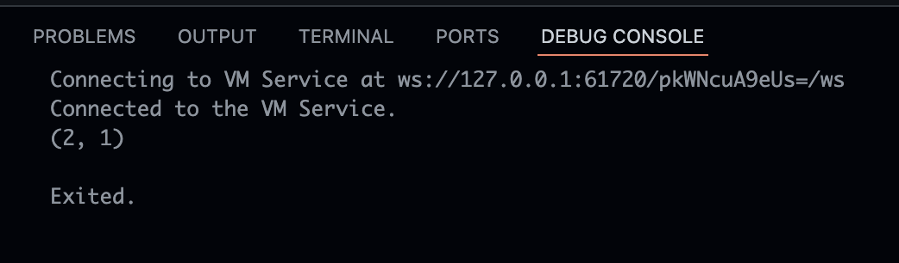

The code defines a ```tukar``` function that accepts a record containing two ints ```(int, int)``` and then uses pattern matching ```var(a, b) = record;``` to split the record into variables a and b. The function then returns a new record (b, a) so that the positions of the two values ​​are swapped. In ```main()```, when ```tukar((1, 2))``` is called, the result is ```(2, 1)```. This demonstrates how records in Dart can be used to store multiple values ​​at once and are easily manipulated with pattern matching.

## Practicum 5 - Answer 3

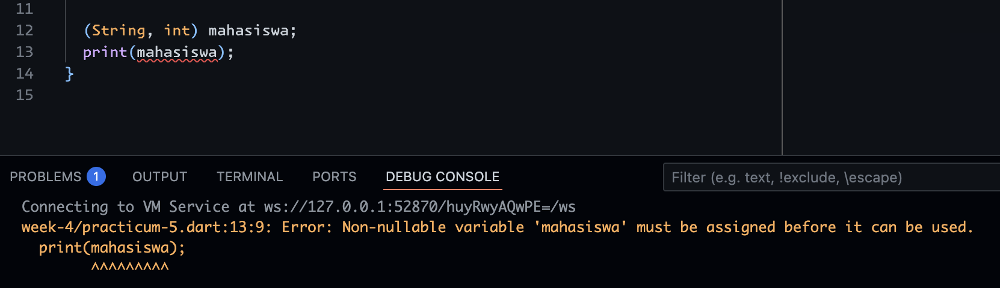

The error occurs because the ```mahasiswa``` record variable of type ```(String, int)``` has been declared but its value has not been initialized, so Dart does not allow calling ```print(mahasiswa)``` on a variable that is still null or has no contents.

And the code with NIM and Name inizialization will be shown like this

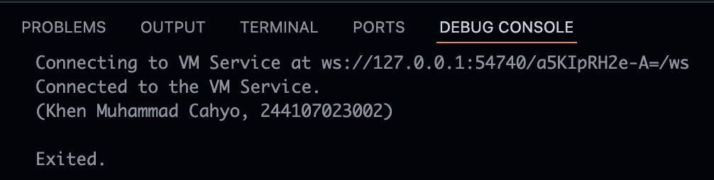

## Practicum 5 - Answer 4

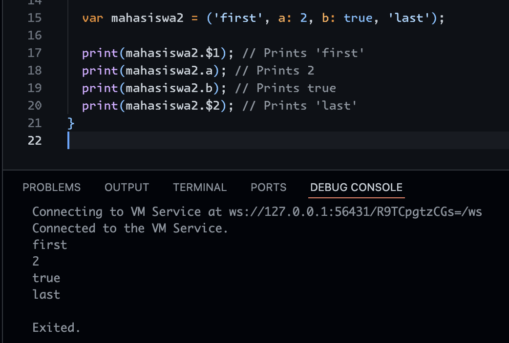

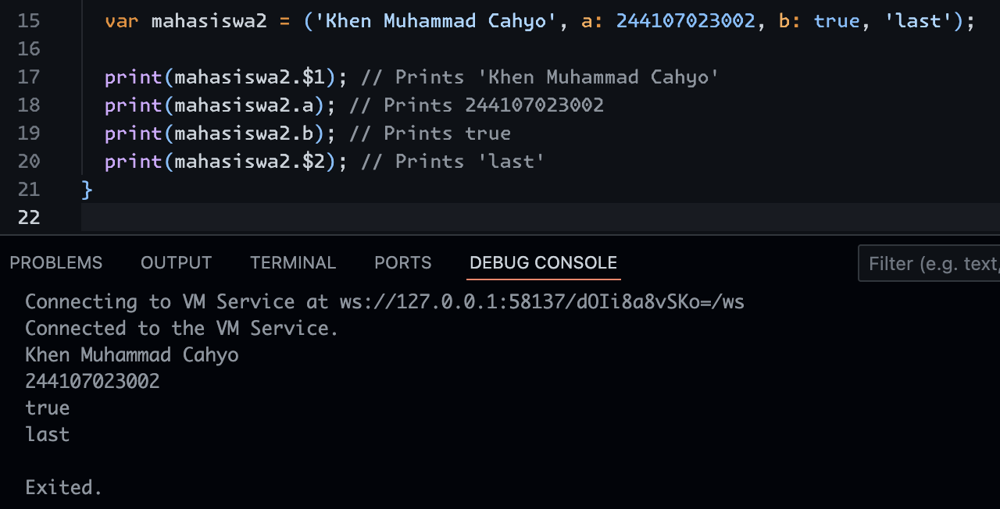

In the code, ```mahasiswa2``` is a record containing positional values ```​​('first', 'last')``` and named values ​​```(a: 2, b: true)```. Records in Dart can be accessed using positional fields using ```$1, $2```, etc., or by named fields like ```.a and .b```. There are no errors in the original code; you just need to adjust the record contents as needed.

## Task Number 2

In Dart, functions are blocks of code that can be called to perform specific tasks, helping to organize programs to be more modular, readable, and reusable. Functions can accept input via parameters, return a value with return, or simply execute without returning a value ```(void)```. Dart supports various types of functions, including regular functions, anonymous functions ```(lambdas)```, and arrow functions for concise writing.

## Task Number 3

### Positional Parameter

These parameters are determined in the order in which the function is called. All parameters must be entered in their proper order. For example:

```dart
void greet(String name, int age) {
  print("Hello $name, age $age");
}

greet("Khen", 23);
```

### Optional Positional Parameter

This parameter is optional and is enclosed in ```[]```. If left blank, its value can be ```null``` or a default value. For example:

```dart
void greet(String name, [int? age]) {
  print("Hello $name, age $age");
}
greet("Khen");
```

### Named Parameter

Parameters are called using their variable names, wrapped in ```{}```. They are optional by default, but can be made mandatory with ```required```. For example:

```dart
void greet({required String name, int age = 18}) {
  print("Hello $name, age $age");
}
greet(name: "Khen");
```

### Default Parameter Value

Optional parameters can be assigned a default value so that they are not null if left unfilled. For example:

```dart
void greet(String name, [int age = 20]) {
  print("Hello $name, age $age");
}
greet("Khen");
```

## Task Number 4

In Dart, functions are first-class objects, meaning they are treated like any other data/object: they can be stored in variables, used as parameters, returned from other functions, or included in collections. This allows Dart to support a flexible functional programming style. For example:

```dart
void sayHello(String name) => print("Hello $name");

void main() {
  var greet = sayHello; // function saved in the variable
  greet("Khen"); // called by variable
}
```

In the example above, ```sayHello``` is saved to the greet variable and then called like a normal function.

## Task Number 5

Anonymous functions are unnamed functions typically used when the function is needed only once or for a simple operation, so it doesn't need to be defined separately. Anonymous functions can be written directly as parameters or stored in variables, and are often used in callbacks. For example:

```dart
void main() {
  var numbers = [1, 2, 3];
  numbers.forEach((n) {
    print(n * 2); // anonymous function print the multiple operation result
  });
}
```

In the example above, the anonymous function ```(n) { print(n * 2); }``` is used directly inside forEach without having to create a separate function.

## Task Number 6

Lexical scope is the rule for determining the scope of a variable based on its code position when it's written, allowing a function to only access variables within the scope where it's defined. Lexical closure, on the other hand, is a function's ability to "remember" and continue using variables from an external scope even when the function is called elsewhere. Examples of lexical scopes:

```dart
void main() {
  var name = "Khen";
  void greet() {
    print("Hello $name"); // can access because in lexical scope
  }
  greet();
}
```

Example of lexical closure:

```dart
Function makeCounter() {
  int count = 0;
  return () {
    count++;
    return count; // count variable still remembered even outside of function
  };
}

void main() {
  var counter = makeCounter();
  print(counter()); // 1
  print(counter()); // 2
}
```

The closure above still remembers the value of ```count``` even though its original scope ```(makeCounter)``` has finished executing.

## Task Number 7

In Dart, a function can return multiple values ​​using records or collections like ```Lists``` and ```Maps```. A more modern approach is to use records, as they have a clearer structure and can have named fields. For example:

```dart
(String, int) getStudent() {
  return ('Khen Muhammad Cahyo', 244107023002);
}

void main() {
  var student = getStudent();
  print(student.$1); // Nama
  print(student.$2); // NIM
}
```

In the example above, the ```getStudent``` function returns two values ​​at once (name and student ID) in the form of a record ```(String, int)```, which can then be accessed via fields ```$1, $2```, or by naming the fields to make them easier to read.