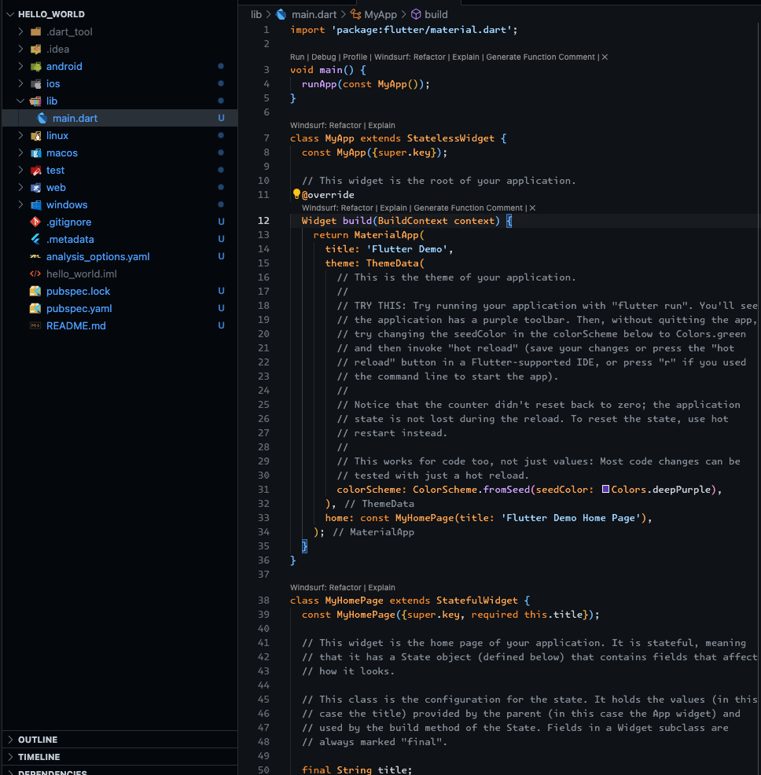
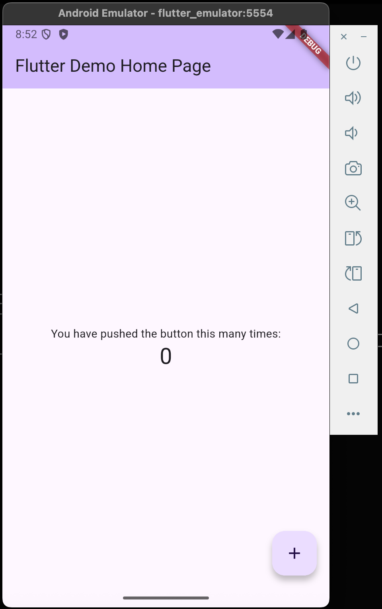
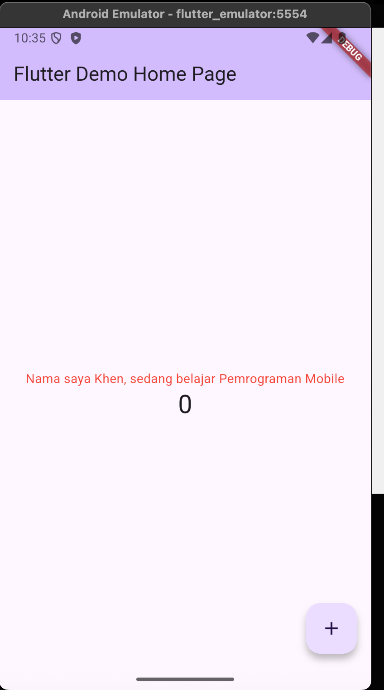
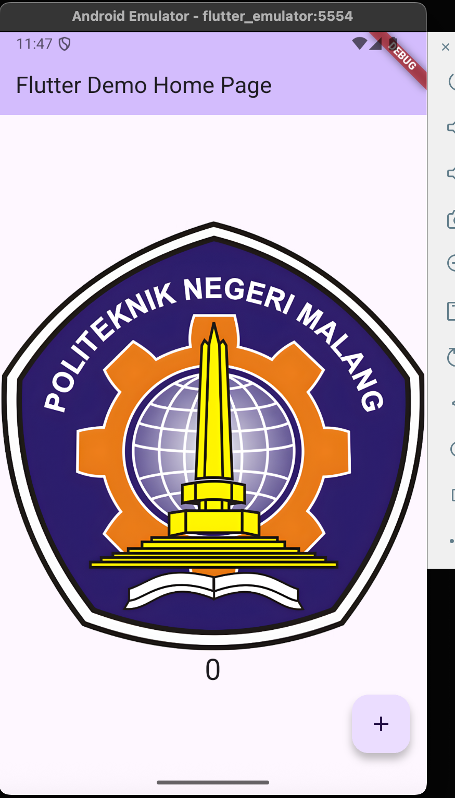
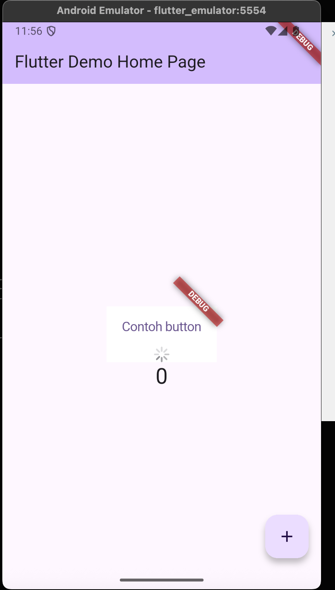
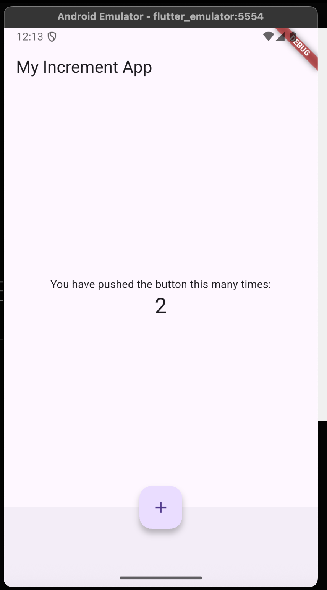
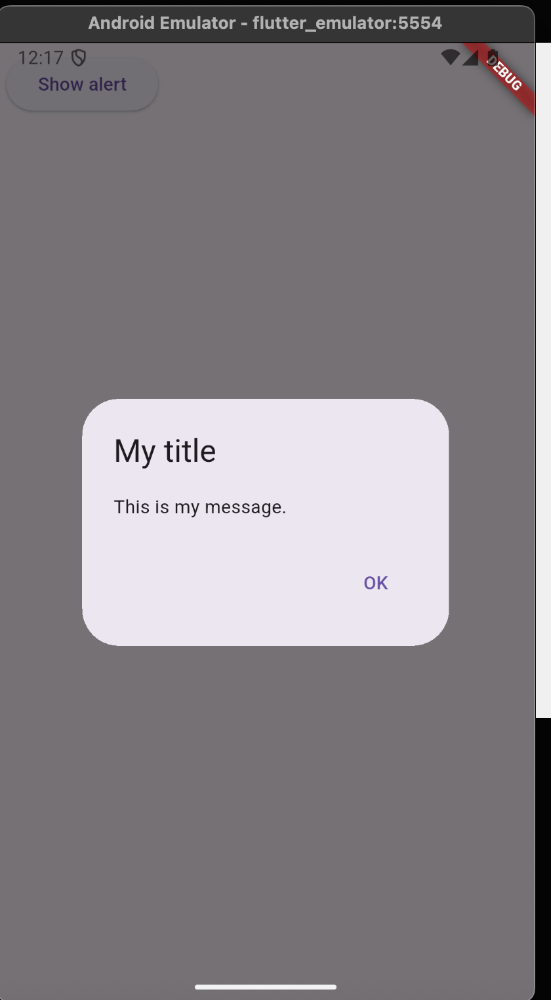
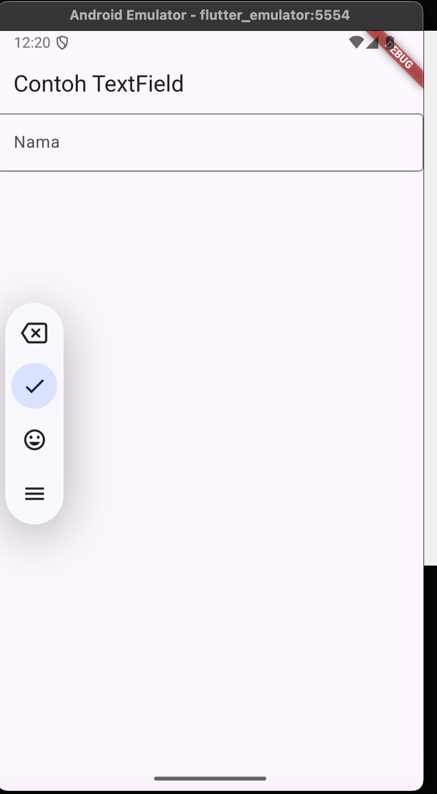
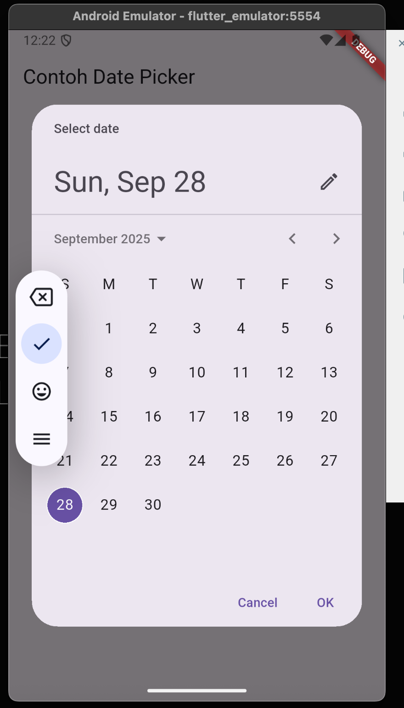

## Practicum 1


## Practicum 2
Because i don't have Android phone, so here i'm used Android phone from emulator.



## Practicum 4

### Text Widget


### Image Widget


## Practicum 5

### Loading Cupertino Widget


### Fab Cupertino Widget
Because there is an errors while run ```main.dart``` using ```fab_widget.dart``` from lab code, so i'm fixed the code using my own fab component but still using Capurtino


### Scaffolding Widget


### Dialog Widget


### Text Field Widget


### Datetime Picker Widget
