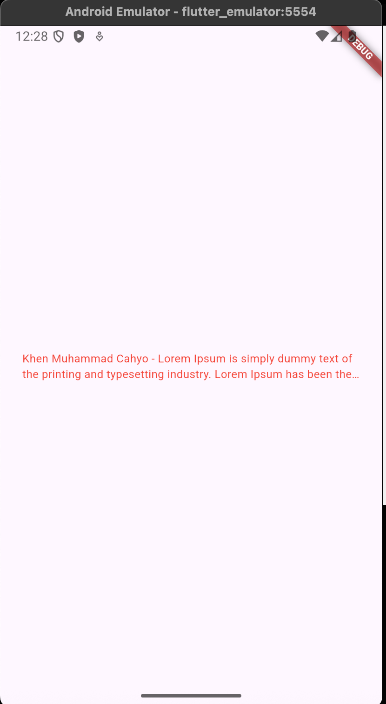

# Practicum Results


# Answer Number 2
The step is for added new plugin in our project, and the plugin called ```auto_size_text```.

# Answer Number 3
The final line ```String text;``` defines the text property, which is immutable (its value cannot be changed after it is initialized). Then the constructor ```const RedTextWidget({Key? key, required this.text}) : super(key: key);``` initializes the widget with the required text parameter when the widget is created.

# Answer Number 4
Functions from those two widgets are same, which is to show text in our screen. But, on ```RedTextWidget``` we are using ```auto_size_text``` widget, and it will slice our long text and slice it with ```....```.

# Answer Number 5
In the `AutoSizeText` widget, the `child` displays a text that automatically adjusts its font size to fit within the available space. The `style` parameter defines the visual appearance of the text, such as its color (`Colors.red`) and font size (`16`). The `maxLines` parameter limits the text to a maximum of two lines, preventing it from expanding further vertically. The `overflow` parameter, set to `TextOverflow.ellipsis`, ensures that if the text exceeds the given space or line limit, it will be truncated and replaced with an ellipsis (`...`). Together, these parameters make the text visually controlled, readable, and responsive within layout constraints.